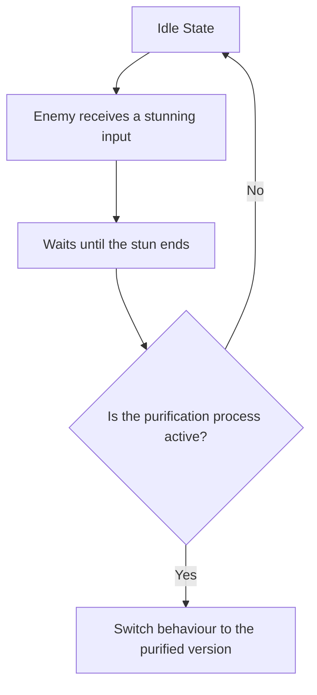

# Enemy

# Description

A hypothetical overall view of the practices and organization is described in this document. These are guidelines for the patterns and considerations for a "purifiable enemy". 
The section [Framework Structure](./framework_structure.md) provides an example of enemy's relationships with its different parts.

## Patterns Of Interest

The following patterns are highly recommended:

- Command[^1] pattern, it ensures focusing the behaviour of the states into the composition of more modular structure.
- Bytecode[^2] pattern, allows an easier swapping of behaviours by defining actions with identifiers, to make the states composition.
- State Machine[^3] pattern, to manage the AI behaviour and transitions between states.
- Scriptable Objects, to define different enemy profiles in a designer-friendly way.
- OPTIONAL: Event Queue[^5], can be interesting based on the VFX feedback for example, allowing more synchronized visuals.

## Example

Let's say we have our "purifiable enemy", which is intended to idle => be stunned => be purified. These three states will be interpreted as:

- Idle => Default state with idle animation and sounds. Used to jump between different states when there aren't external inputs.
- Be stunned => As a transitional state where the enemy can't perform any actions (visual feedback is essential here).
- Be purified => As state where general behaviour and visuals switch completely.

Our state machine[^3] is intended to have a compilation of states, it ensures the correct transition between these but not necessarily the intended order of execution. 
That responsibility remains on the controller via inputs or inside the states where a flow and transitions may be defined. 
For example a behaviour Idle => Patrol, can be defined with the actions; Idle(Wait, Change State) => Patrol(Move to X, Change State), this example flow can be interrupted by an input.

Going back to our initial example, here a simplified flowchart:

> [!NOTE]
> - As mentioned before, the behaviours are a collection of states and the states are a collection of actions.
> - If everything is well-defined through Interface Segregation[^4], we can use scriptable objects to make definitions of behaviours.
> - The purpose of the state machine is the correct transition between states interfaces. Liskov Substitution principle can be applied, allowing drastic variations when switching 'normal' behaviours to 'purifiable' behaviours.

[^1]: https://publish.obsidian.md/jmhg/01-developer_journey/02-code_patterns/00-design_patterns/00-command
[^2]: https://publish.obsidian.md/jmhg/01-developer_journey/02-code_patterns/03-behavioral_patterns/00-bytecode
[^3]: https://publish.obsidian.md/jmhg/01-developer_journey/02-code_patterns/00-design_patterns/02-finite_state_machine
[^4]: https://publish.obsidian.md/jmhg/01-developer_journey/00-code_philosophy/00-solid
[^5]: https://publish.obsidian.md/jmhg/01-developer_journey/02-code_patterns/04-decoupling_patterns/00-event_queue

