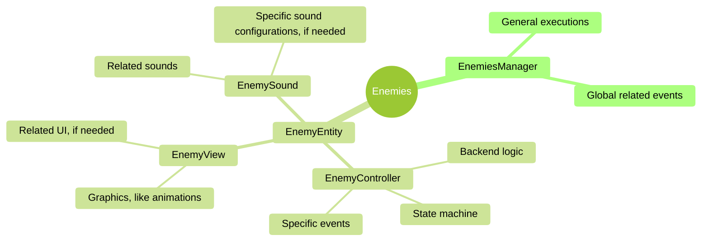

# Framework Structure

# Description

A hypothetical overall view of the practices and organization is described in this document. These are guidelines for the patterns and considerations to ensure a homogeneous code structure and readability of the project.

## Programming Practices

For performance-demanding and larger projects, ECS[^1] and the use of DOP[^2] (Data-Oriented Programming) are recommended, but to follow the more standardized practices in the indie field the following practices are used:

- OOP (Object-Oriented Programming)[^2] for class structure and organization of responsibilities.
- EOP (Event-Oriented Programming)[^2] for data sharing and input/output communications between entities or systems.
- Controller-View[^3] for entities, UI or other applicable situations to separate logic (backend) from graphics (frontend).
- Managers for complex groups of entities, pooling or more abstract implementations.
- SOLID[^7] as principles to keep in mind during the development.

## General Structure Patterns

- Dependency Injection[^4] for less-coupled instantiations.
- Singleton[^6] for easier access to general tools or managers. IMPORTANT: This pattern must be used with caution, to avoid unused managers and problems with missing dependencies.
- OPTIONAL: Design By Contract[^5] as a way to ensure general software quality, although not widely practiced, it is recommended.

### Code Practices

Although OOP is mentioned for the class structure and organization of responsibilities, inheritance will be used with caution to avoid "hanging code" between classes. Instead the focus is switched to:

- Composition, to encourage less-coupled code and single responsibilities[^7]. Also this allows for smaller scripts, encouraging maintainability and readability of the code.
- Interface Segregation[^7], to ensure more atomic and modular code.

For a deeper view of class structures, guidelines can be found in the [Code Style Guide](https://publish.obsidian.md/jmhg/01-developer_journey/01-code_style/01-code_style_guide) mentioned in [README](../README.md).

# Example

Here a quick example of a hypothetical and simplified structure:

[^1]: https://publish.obsidian.md/jmhg/01-developer_journey/00-code_philosophy/03-ecs_architecture
[^2]: https://publish.obsidian.md/jmhg/01-developer_journey/00-code_philosophy/01-programming_paradigms
[^3]: https://publish.obsidian.md/jmhg/01-developer_journey/00-code_philosophy/04-controller_view
[^4]: https://en.wikipedia.org/wiki/Dependency_injection
[^5]: https://publish.obsidian.md/jmhg/01-developer_journey/02-code_patterns/02-defensive_patterns/01-design_by_contract
[^6]: https://publish.obsidian.md/jmhg/01-developer_journey/02-code_patterns/00-design_patterns/01-singleton
[^7]: https://publish.obsidian.md/jmhg/01-developer_journey/00-code_philosophy/00-solid

